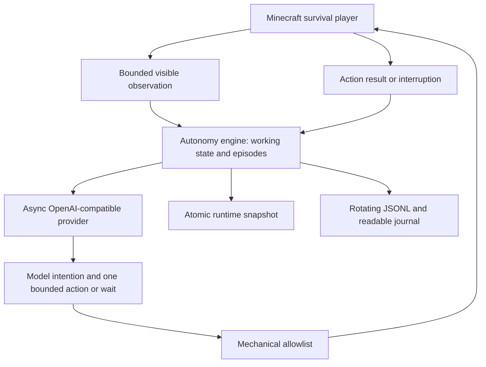

# Continuous autonomy

## Purpose

The model owns intentions, priorities, destinations, and the meaning of progress. The persistent directive is exactly:

> Survive independently. Your only requirement is not to idle without purpose. Progress is a fluid goal but must always be the target. What constitutes progress is yours to determine.

There is no final mission, progression tree, resource score, survival tutorial, or seeded strategy in the autonomous prompt. The existing human-assigned goal mode remains available.

## Architecture



`AutonomyCoordinator` owns a server-thread session per bot. `AutonomyEngine` is independent of Minecraft and owns timing, intention state, cancellation, retries, waits, and bounded memory. `AutonomyProvider` uses asynchronous HTTP; no network call blocks the server tick. Immutable request/result data crosses that boundary. `AutonomyEmbodiment`, `AutonomyObservation`, and `MechanicalCrafting` provide the Minecraft adapter. `AutonomyJournal` uses a bounded, ordered background writer.

An autonomous bot bypasses `BrainCoordinator`'s assigned-goal prompt/registry, `GoalPlanner`, `GoalExecutor`, legacy tasks, `SurvivalGuard`, `DangerWatcher`, `NavSafetyNet`, `StuckWatcher`, automatic equipment selection, and `IdleCoordinator`. Pending legacy decisions are invalidated on mode entry. Legacy tool dispatch and task assignment are rejected while autonomy owns the bot. See the [complete audit](AUTONOMY_TOOL_AUDIT.md).

## Decision loop and idle semantics

Each decision receives the current observation and working state. The latter contains the last result, intention, recent episodes, failure budgets and the model's durable summary. The model calls `decide` with an intention and exactly one physical action or `deliberateWait`. It can keep an intention across actions or revise, complete, abandon or defer it. Only the model writes its purpose and memory summary.

Action completion/failure, damage, death/respawn, a wait ending, or absence of current work brings control back to the model. A standing intention does not prevent another decision after its action finishes. Stillness during a declared wait is valid. There is no timer that forces random movement. Bounded actions and waits guarantee eventual reconsideration; provider outages are explicitly represented as backoff.

Defaults at nominal 20 ticks/second:

| Limit | Default |
|---|---:|
| Minimum decision spacing | 40 ticks / 2 seconds |
| Maximum action | 600 ticks / 30 seconds |
| Maximum local movement | 100 ticks / 5 seconds |
| Maximum wait / decision interval | 1,200 ticks / 60 seconds |
| HTTP timeout | 90 seconds |
| Provider retry delay | 100–6,000 ticks / 5 seconds–5 minutes, exponential |
| Equivalent physical failures before suppression | 3 |
| Recent episodes | 32 |
| Model-written summary | 4,000 characters |

Provider failure never selects a fallback strategy. It logs a sanitized error and retries. One request per bot can be active; cancellation invalidates its reply. Repeated equivalent failed actions are suppressed until relevant observed evidence changes. Time passing or small position jitter does not by itself erase the failure budget. The model receives the failure and chooses another operation or wait.

## Tool and perception boundaries

The allowlist includes inspection, looking, local movement/sprint/jump/swim input, bounded navigation, mining one selected block with the held tool, placing one held block, reachable entity attack/interaction, block interaction, explicit inventory equip/swap/drop, held-item use, a selected available recipe, normal screen slot clicks, and closing a screen. The decision envelope provides purposeful waits separately.

Crafting selects no output on the model's behalf. It uses a named vanilla recipe and the current player/table screen. Missing ingredients or grid capacity produce a failure; no recursive crafting, station construction, or resource acquisition starts. Furnace input, fuel, and output use normal block interaction and screen slots, so vanilla furnace ticking owns smelting. The model chooses the items and timing. Inventory and screen slot numbers are distinct and appear in observations.

Observations contain personal status, effects, inventory/equipment slots, current screen slots, bounded visible blocks/entities, and encountered positions. Uniform first-hit rays sample nearby surfaces; enclosed block contents and invisible entities are excluded. Sky conditions are included when sky is visible. Server game time is journal metadata, not an underground clock supplied to the model. No resource ranking, danger score, biome/structure lookup, unexplored map, or strategy hints are included.

Navigation reuses A* movement competence without strategic digging, pillaring, or teleport recovery. Destination and route knowledge are restricted. The physical controller uses player motion and collision; failure becomes an action result. Mechanical collision geometry and recipe definitions are still deterministic knowledge below the model. These are embodiment rules, not priorities.

## Survival and death

Autonomy requires `strict_survival`. Operator mode cannot start/resume it. Paused and stopped autonomy retain ownership, so legacy safety/progression code cannot take over. Actions additionally reject creative/spectator players. The autonomous registry contains no hidden-block scan, teleport, forced pickup, remote mutation, night-skip, or strategic acquisition tool.

Death uses vanilla damage and drops. After the ordinary death delay, the fake-player adapter makes the equivalent of a respawn request. Vanilla chooses the bed/anchor/world spawn and copies appropriate player state. A narrow mixin preserves the fake-player subclass; the manager and network handler are updated to the replacement entity. No corpse retrieval task or return teleport is scheduled. The model receives death and respawn events. Paused/stopped decision-making remains paused/stopped. Use ordinary survival, not hardcore, for this experiment.

## Memory, saving, and journals

Working state keeps the intention separate from the current action or wait, latest result, retry state and recent events. Older episodes are evicted; a bounded model-written summary carries information forward. Remembered coordinates are bounded and dimension-scoped. The summary can retain facts about older places. Memory starts empty.

The existing atomic `aibot/runtime.json` world snapshot gains an optional per-bot autonomy object. Old manual snapshots remain readable. Saves include phase, intention, summary, episodes, failures, remaining wait/backoff, and encountered places. Restart restores decisions; interrupted physical actions and HTTP requests are never replayed. A saved purposeful wait resumes with its bounded remaining duration. A saved death continues through the respawn adapter. Regular saves, controls, and shutdown use the existing persistence writer.

For each bot UUID:

```text
<world>/aibot/autonomy/<uuid>.jsonl
<world>/aibot/autonomy/<uuid>.log
```

Each format rotates at 16 MiB by default and retains eight numbered backups (288 MiB maximum combined, excluding filesystem overhead). The ordered writer queue is capped at 256 events. Disk/queue failures do not stall the tick; gaps are recorded when writing recovers. The status command reports journal problems. Stop the server normally to flush the journal and snapshot. A crash can lose the newest asynchronous entries.

Journal fields include UTC timestamp, engine tick, game time, dimension/position, health/hunger, intention changes, selected actions, results, death/respawn, provider errors, latency and token counts when supplied. Only explicit public purposes are retained. The provider ignores reasoning fields and never logs raw response bodies or API keys. Existing diagnostic logs remain under the configured `logs/aibot` directory.

## Requirements and installation

| Component | Version |
|---|---|
| Minecraft Java Edition | **1.21.3** |
| Java | **21** |
| Fabric Loader | **0.18.4 or newer compatible with 1.21.3** |
| Fabric API | **0.114.1+1.21.3** |
| Development Yarn mappings | **1.21.3+build.2** |

1. Install a Fabric 1.21.3 server or Fabric 1.21.3 client profile for a single-player world.
2. Place `build/libs/aibot-0.0.1-autonomy.2.jar` and the matching Fabric API jar in `mods/`. Remove older duplicate AIBot jars. Do not install the `-sources.jar`.
3. Start once to generate configuration, then stop normally.
4. Configure the provider and strict profile below; restart with Java 21.
5. For multiplayer, the bot runs server-side. Installing AIBot on the client additionally provides its existing panel. Commands work without using that panel.

Build from source with Java 21 on `JAVA_HOME`:

```powershell
git clone --branch codex/continuous-autonomy https://github.com/samuelrowan20/mc_aiplayer.git
cd mc_aiplayer
.\gradlew.bat clean build
```

The build includes JUnit and Minecraft GameTests. The GameTest source set is isolated from the production jar. See [AUTONOMY_VALIDATION.md](AUTONOMY_VALIDATION.md) for actual results and source inventory.

## Model configuration

Use an OpenAI-compatible **Chat Completions endpoint supporting function/tool calls or JSON-schema responses**. A ChatGPT subscription supplies no API key. A hosted compatible provider is sufficient; a local model is optional.

In `config/aibot.json`, keep other generated options and set:

```json
{
  "profile": "strict_survival",
  "operatorCapabilities": {
    "hiddenBlockScan": false,
    "emergencyTeleport": false,
    "forcedPickup": false,
    "manualTeleport": false
  },
  "deepseek": {
    "baseUrl": "https://YOUR-PROVIDER.example/v1",
    "model": "YOUR-MODEL-ID",
    "apiKey": "",
    "maxTokens": 4096,
    "reasoningEffort": "low"
  }
}
```

The legacy `deepseek` section name is retained for compatibility; it does not lock autonomy to that provider. The adapter appends `/chat/completions` to `baseUrl`; use the provider's documented API prefix. Set an environment variable in the process that starts Minecraft/server:

```powershell
$env:AIBOT_API_KEY = 'your-provider-api-key'
$env:AIBOT_PROFILE = 'strict_survival'
# Launch the Fabric server or launcher from this same PowerShell session.
```

`AIBOT_API_KEY` takes precedence over the legacy `DEEPSEEK_API_KEY`, then the config key. Do not put real keys in source control. Keyless compatible local endpoints are also allowed.

`config/aibot-autonomy.json` is generated with mechanical bounds. Set `reasoningMode` to `none` (default, portable), `openai` (`reasoning_effort`), or `deepseek` (explicit thinking configuration). Use only a mode your provider supports. An optional `reasoningEffort` in this file overrides the main provider section, whose legacy validation only accepts DeepSeek effort names. Private reasoning output is discarded. Changing configuration requires restart; invalid autonomy configuration prevents starting it.

`decisionFormat` in that file defaults to `tool_call`. Providers with schema-constrained JSON responses can use `json_schema` instead. Both formats pass through the same decision validation and physical allowlist. JSON mode sends complete action/wait alternatives because some grammar implementations ignore sibling properties beside `oneOf`.

### Local Ollama / Qwen3 4B

Ollama can use `http://localhost:11434/v1` with the placeholder key `ollama`. The original `qwen3:4b` returned a valid decision in a local schema-constrained smoke test. Its tool-call responses failed validation in that test, so use the JSON mode introduced in autonomy.2.

For growing observations and memory, create an alias with a larger context window. This reuses the installed weights and original template:

```text
# Save these two lines as Modelfile.aibot
FROM qwen3:4b
PARAMETER num_ctx 16384
```

```powershell
ollama create qwen3:4b-aibot -f Modelfile.aibot
```

Set the existing `deepseek` section in `config/aibot.json`:

```json
{
  "baseUrl": "http://localhost:11434/v1",
  "apiKey": "ollama",
  "model": "qwen3:4b-aibot",
  "maxTokens": 1024
}
```

Set these fields in `config/aibot-autonomy.json`, keeping the other generated fields:

```json
{
  "decisionFormat": "json_schema",
  "reasoningMode": "openai",
  "reasoningEffort": "none",
  "providerTimeoutSeconds": 180
}
```

Here `openai` selects the compatible `reasoning_effort` request field; the endpoint remains local Ollama. Leave Ollama running and restart Minecraft after changing configuration or the jar. Latency depends on local hardware and context size; this smoke test does not establish overnight survival quality. See [Ollama's compatibility documentation](https://docs.ollama.com/api/openai-compatibility) for response formats and model context configuration.

## Groq quota and compact context

For Groq, set `deepseek.baseUrl` to `https://api.groq.com/openai/v1`, `model` to `qwen/qwen3.8-27b`, and `maxTokens` to `1024` in `config/aibot.json`. Keep the key in that local configuration. Set `decisionFormat: "tool_call"`, `reasoningMode: "openai"`, `reasoningEffort: "none"`, `maxSummaryChars: 2000`, and `dailyTokenLimit: 200000` in `config/aibot-autonomy.json`. Restart Minecraft after changing configuration or the jar.

Each inference contains the standing directive, one action schema, current status/inventory, up to 16 visible blocks, 8 entities, 8 remembered positions, a 2,000-character memory summary, the previous action/result, and at most four relevant recent events. Screen contents are bounded and duplicate player inventory slots are omitted. Target coordinates are retained when present. The full journal and runtime history stay on disk. The model can replace its persistent summary in each decision.

Groq admission is capped at 200,000 tokens per rolling 24 hours across all autonomous bots and worlds sharing the configuration folder. A lower configured cap is honored. Before HTTP, the durable ledger reserves request UTF-8 bytes plus the maximum output tokens and a framing allowance. Valid provider usage releases unused reservation; timeouts, malformed usage, and other uncertain outcomes retain it conservatively. Pending requests retain their reservation for an additional ten minutes. Missing disk access or corrupt budget state blocks requests. Preserve `config/aibot-autonomy-token-budget.json` across restarts; deleting it loses accounting.

HTTP 429 honors `Retry-After` seconds or HTTP dates, with a 60-second fallback. The cooldown is shared and persisted. Exhausted quota waits until enough reservations expire; ordinary world physics continue while inference is deferred. Status reports remaining local budget and retry delay. Legacy manual Groq inference is disabled because it bypasses this ledger; use `/aibot autonomy start Bob`.

This ledger accounts for this installation's requests. Other applications using the same Groq organization also consume its quota and may cause earlier 429 responses. A 200K budget can limit the number of decisions substantially; it does not guarantee continuous overnight inference. Groq documents organization-wide limits and retry headers in its [rate-limit guide](https://console.groq.com/docs/rate-limits).

## Commands

```text
/aibot spawn Bob
/aibot autonomy start Bob
/aibot autonomy status Bob
/aibot autonomy pause Bob
/aibot autonomy resume Bob
/aibot autonomy stop Bob
```

`start` installs the standing directive automatically. `resume` resumes a paused session; `start` restarts a stopped session. `stop` cancels autonomy work and leaves the bot quiescent, with ordinary world physics and damage still active. To intentionally restore the original assigned-goal behavior:

```text
/aibot autonomy manual Bob
```

Commands use the existing owner/operator authorization gate. Existing panel pause/resume/cancel controls route to autonomy while it owns the bot. Status and the journal are the authoritative views of autonomous intentions; the legacy panel's goal/task cards describe the old mode.

## First overnight run

1. Use a new ordinary survival world, normal difficulty, cheats/command permission for the human, and `keepInventory=false`. Avoid hardcore. Back up worlds you care about.
2. Configure a compatible model and enough provider credit/quota for the intended duration. At minimum spacing, a model repeatedly choosing immediate actions can request roughly 30 decisions/minute per bot; actual rates depend on action duration and model latency.
3. Spawn Bob and start autonomy once using the commands above. Enter spectator mode with `/gamemode spectator`.
4. Watch the first several decisions. Confirm the journal shows intentions, actions, and results, and status is not continuously reporting provider errors. Test pause/resume once.
5. Leave Minecraft actively running. Do not open the single-player pause menu, suspend the computer, or close the server. A dedicated server avoids single-player pause behavior. Keep the machine powered and network connected.
6. In the morning, pause Bob, inspect status and journals, then stop the server normally. Preserve the world snapshot, journal backups, configuration without secrets, and provider/model identifier as your experiment record.

## Known limits

- Deterministic and world-backed tests are not evidence of good model judgment or overnight survival. A real hosted-model overnight run still needs validation.
- Limited ray sampling can miss small/occluded surfaces. Navigation is local and conservative; complex jumps, caves, fluids, moving obstacles and long routes can fail. The model must choose follow-up actions.
- Recipe identifiers are namespaced vanilla identifiers. No strategy-rich recipe discovery/acquisition catalogue is injected. Unsupported screen operations fail; unusual modded recipes/interfaces are unverified.
- Memory is lossy by design. Journals rotate, and disk faults may produce explicitly recorded gaps. Snapshots recover ordinary saves, not every last event before a crash.
- No deterministic objective-quality judge exists. The model may repeatedly wait, inspect, choose poor intentions, or die. Equivalent failed physical actions are bounded; a strategy fallback is deliberately absent.
- Legacy manual mode still contains strategic and privileged compatibility code. Its presence is documented; autonomy's separate ownership and allowlist are the boundary.
